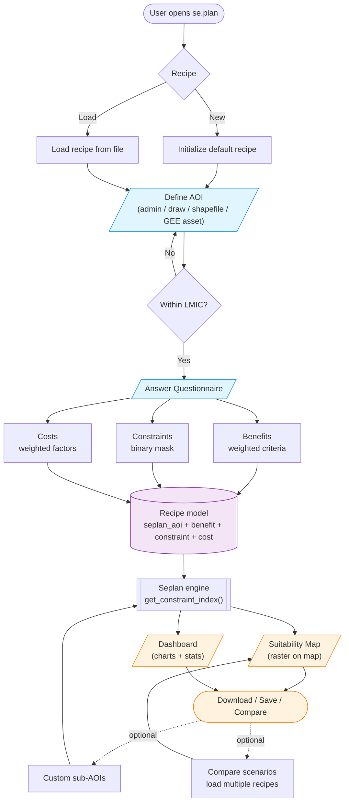

# se.plan Workflow

High-level diagram of the user workflow in se.plan, from opening the app to producing a suitability map and dashboard.

## Stages

1. **Recipe** — create a new recipe or load an existing one. The recipe is the central data model holding AOI, benefits, constraints, and costs.
2. **Define AOI** — pick a study area via admin boundaries, drawing, shapefile, or a GEE asset. Validated against LMIC scope.
3. **Questionnaire** — weight benefits and costs and pick constraints (binary mask) for the analysis.
4. **Compute** — the Seplan engine combines benefits, constraints, and costs into a suitability index.
5. **Outputs** — suitability map (raster) and dashboard (charts + stats), available for download.
6. **Optional** — refine with custom sub-AOIs, or compare multiple recipes side by side.
